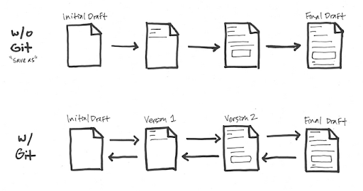
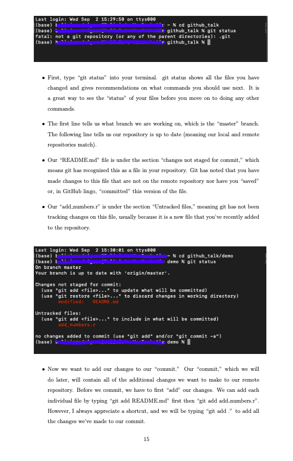

_Updated (02/06/21)_: I've created a GitBook version of my documentation [here](https://intro-to-github-docs.beliciarodriguez.com/).

_Background_: As a senior undergraduate student at Emory, I had the pleasure of being invited to talk to an Emory undergraduate research course on how to begin using GitHub, and the following post summarizes the key points of that talk. I will be reviewing version control systems, the connection between Git and GitHub, and introducing the purpose behind common git commands (i.e push, pull, commit). Additionally, I will highlight portions of my [detailed handout](introduction-to-github-website.pdf) which goes step-by-step into how to create a repository, how to update a local and remote repository using Git commands, etc. For a detailed write-up of my talk, please see my handout, which contains my notes for the presentation and demonstration and was distributed to the students of the class.

___

Before we begin discussing the purpose and function of Git and GitHub, let's start with understanding what version control systems are. A version control system allows you to make changes to a file or a set of files over time.

How is this different from how we normally save versions of documents? Imagine you are writing a paper for a course. You write the first paragraph, save, exit out of the document, return to the document the next day, rewrite the first paragraph, add a second paragraph, and save. Now, you're rereading your first paragraph and realize you liked the first paragraph you wrote yesterday better. As much as you may want that first draft back, that version of your document is no longer available.

Here is where version control solves your problem. With version control, you have access multiple versions of a document, meaning you'll have a record of all the changes that has been done to a document. Your file's versions are stored in a version database. If you don't like a current version of a document and want to revert back to an older version, you can. That first paragraph from yesterday is now easily accessible.

What does version control have to do with Git? Git is a type of version control called _distributed version control system_. Pretend that we have a computer A, or your local computer, where all of your file's versions are stored in a version database, or a repository. What happens if you spill coffee all over your keyboard and lose all your files? You'd lose all your documents and their versions! Git can also store a copy of your local repositories in a server computer, or GitHub. That way, after you get a new computer, you can retrieve all of your versions and documents from the server computer.

Having your repositories in a server has an added benefit--you can now access your repositories from any other computer i.e a work or remote computer. You can also update your server repository from a remote computer; that way, once your finished working on your repository at work, you can send it back to the server, and when you get home, you can upload your changes and continue working with your most up-to-date repository.

We mentioned GitHub as our "server computer" in our example, but in more general terms, GitHub is a centralized location for hosting git repositories (think: Git HUB). As far as I know, git repositories can store and update almost any file type including Python and R scripts, Jupyter notebooks, RMarkdown files, and PDFs. We've previously said we can store a copy of our local repository on GitHub.com, but how do we technically do that? There are four Git commands that complete this process:

1. _git add_: tells git you want to add a version of a file to your local repository
2. _git commit_: saves the versions of the files you previously "git" added to your local repository
3. _git push_: sends the updated local repository to your server repository
4. _git pull_: if changes were made to your server repository, git pull updates your local repository with those changes

The following diagram shows the way the commands are used between local, server, and remote repositories:

Now that we've established our understanding of git and GitHub, how do we get started? To complete the process we've been outlining, we will complete the following steps:

1. Download Git onto your local computer.
2. Create a GitHub account.
3. Create a repository on GitHub.
4. Create a copy of your repository on your local computer.
5. Add a file to your local repository.
6. Push your file to GitHub.
7. Make changes to a file on GitHub.
8. Pull changes to your local computer.

To accomplish these steps, I would like to refer you to my [handout](introduction-to-github-website.pdf), which contains screenshots of my browser and terminal that show each step in the process. Section 2 of the handout goes over how to install git for Windows, Linux, and Mac computers. Section 3 reviews how to set up a GitHub account. Section 4 talks about creating a repository. Finally, section 5 shows how to use the git commands to update your repository.

Here's a preview of section 4 and 5 of the handout:

And that's it! After reviewing the handout and going through the demonstration, the power of git and GitHub are at your fingertips. Happy committing!
