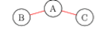
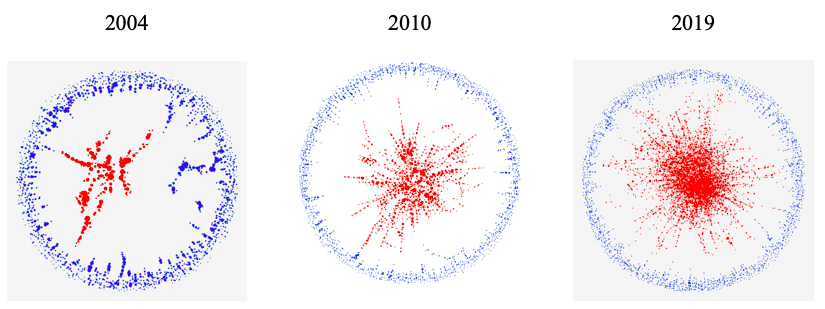

During the summer of 2020, I researched whether co-authorship networks in the top five economics journals modeled small-worldness.

What is a co-authorship network? A co-authorship network shows the connections between authors who have published a paper together. Take the following sample co-authorship network as our example.

Author A and Author B have written a paper together, Author A and Author C have written a paper together, but Author B and Author C have not written a paper together. This co-authorship network has three authors and two papers, but, in reality, co-authorship networks consist of thousands of authors and thousands of papers.

The question we sought to answer was, "What can co-authorship networks tell us about the community of authors publishing in T5 general interest economics journals?" Our research group created a dataset with all the papers and authors from these journals, and we first looked into the characteristics of our network. We saw two important observations:

1. The author's connections had a high probability of being connected to each other.

Let's return to our sample network; since B and C are connected to A, then there's a good chance that they will end up writing a paper together. Maybe A introduces B and C to each other, or A, B, and C write a paper together.

In network analysis, this is a characteristic of having a high clustering coefficient, defined as the fraction of the author's connections that are connected to each other. In our example, the clustering coefficient is 0 since author A's connections are not connected to each other. If B and C were connected, then the clustering coefficient would be 1.

2. The number of steps to travel from one author to another in a network was small.

In our example, the steps to "travel" from author A to author B is 1, the steps from A to C is 1, and the steps to B to C is 2.

In network analysis, the average shortest path would define the average number of steps in the shortest path for all possible pair of nodes. In our example, the average shortest path is 1.33 since (2+1+1)/3 = 4/3 = 1.33.

Having a high clustering coefficient and a small average shortest path are both characteristics of small world network models, which are models where the author's connections are generally connected to each other.

Our research team decided to confirm these results using Humphries and Gurney's small-worldness statistic, which uses the clustering coefficient and average shortest path as part of the calculation.

First, we created co-authorship networks for each year. For example, for 2004 we would take all the published papers in 2004 and papers previously published, create the network using Python's NetworkX, and calculate the statistic. We did this to see if there were any trends or changes in whether our networks were small world or not from year to year.

Our study found that, according to the statistic, our networks were all small-world networks. As a visual aid, we created visualizations of our per year co-authorship networks using Gephi.

The red nodes, or circles, signify all the authors who are part of the largest connected group. The blue nodes are not in the largest connection. Overtime, more authors are added to the largest group until majority are in the largest connected group.

Therefore, this study shows that authors publishing in these top five general-interest economic jouranls tend to be interconnected with each other and form small communities. This study is a precursor into our study of creating co-authorship networks using natural language processing.
